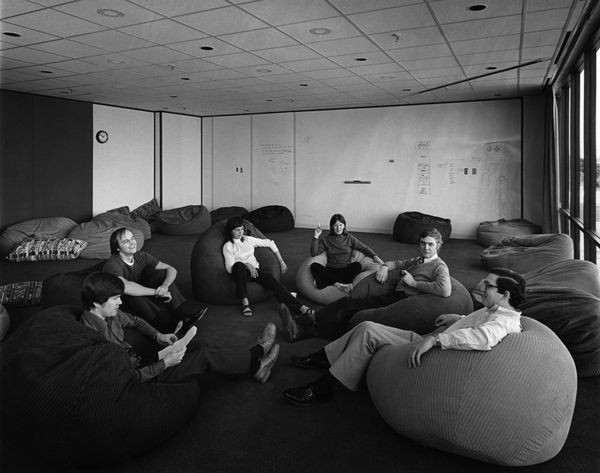
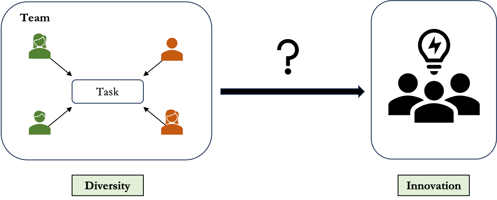
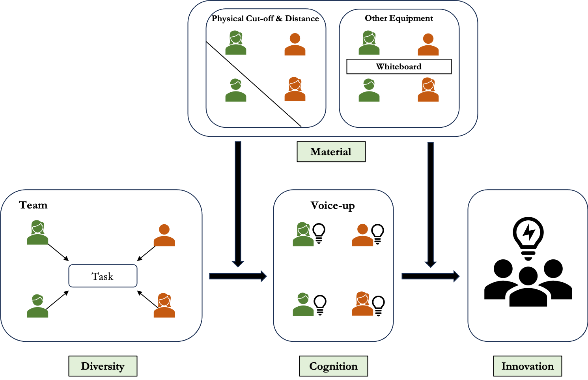

## When diversity *does* become innovation  
### The Macintosh team, 1984

::: columns
::: column
{fig-alt="Macintosh team in 1984"}
:::

::: column
- __Diverse team__ including artists, typographers, engineers...
- Turned GUI + mouse into a **shipped, iconic product**

> Diversity in the team + ? → **revolution and innovation**
:::
:::

## When diversity _doesn’t_ become innovation  
### Xerox PARC, 1970s

::: columns
::: column
{fig-alt="Researchers working in the Xerox PARC lab"}
:::

::: column
- Similar __diverse team__ of scientists, designers, programmers...  
- Invented GUI, mouse, Ethernet — **but stayed in the lab**  

> Diversity in the team + ? → **insufficient breakthroughs**
:::
:::

::: {.center}
## Roadmap

1. __Research Intuition__: Question and Gap

2. __Case Study__ with Quantitative and Computational Methods

    - Study 1: Field Surveys in R&D and Art Studios
    - Study 2: Generative Simulation

3. __Contributions & Timeline__
:::

## Research Intuition

### Question: How does Diversity translates into Innovations?

## Research Intuition

### Existing Answers to the Question

__Organizational Studies:__ Mixed Results
      
- Yes! [@reagans_networks_2001]

- No! [@phillips_demography_1998]

- It depends… [@knippenberg_work_2007]

__Cultural Evolution/Science of Science:__ Explaining Variations in ...

- Diversity [@uzzi_collaboration_2005; @cao_subjective_2025]

- Innovation [@shi_science_2020]

## Research Intuition

### Gaps: Bringing Sociology of Culture in 

Innovation as a __cultural process__ - individual cognition to shared meaning

1. Cognitive Gap: the Internal Mechanism [@dimaggioCultureCognition1997;@vaiseyMotivationJustificationDualprocess2009]

- __Voice-up__ could be the mediator between diversity and innovations

- __How do diverse members speak of their ideas?__

2. Material Gap: the External Mechanism [@mcdonnellCulturalObjectsMaterial2023]

- __Environmental settings__ could be the moderator between diversity and innovations - the constraints on the voices of members

- __How are the voices from diverse members get amplified or ignored?__

## Research Intuition

### Research Question Revisited

## Case Study

### Two cases from the real world

1. R&D teams: formalized collaboration and innovations related to performance (~5)

2. Art studios / creative hubs: usually informal interactions and not performance-based productions (~5)

Testing through these two cases allows examinations of __how the diversity-innovation black boxes unfolds differently__

## Case Study

### Study 1 Field Surveys

__Two-wave survey__ to collect data across 6 months:

- _Wave 1_: Individual Background; Collaboration Networks; Spatial Data; Open-ended Idea Descriptions

- _Wave 2_: Innovations/Productions (made or not); Team/Studio Evolution

## Case Study

### Study 1 Field Surveys

__Variables:__

- _Diversity_: measured from Wave 1 backgrounds

- _Innovations_: measured from Wave 2 innovations

- _Voice-up (Cognition)_: measured from Wave 1 open-ended ideas

- _Environment settings (Materials)_: measured from Wave 1 spatial data and collaboration networks

__Methods:__ Regressions in task/production level

Limited in __sample size__ and generalizability to __longer period__

## Case Study

### Study 2 Generative Simulation

Using LLMs and diffusion-based visual models to simulate agents and test compositions and space designs

- __Agents__: Calibrated on Study 1, simulated by generative models

- __Environmental settings__: Assigning different kinds of physical cut-offs and equipment

- __Simulation rounds__: Agents interacting with each others -> Agents generating new ideas -> Voting for whether innovative or not

Evaluate how __spatial configurations__ would lead to different ends of production trajectory.

## Contributions

- __Methodological__: Making template for integrating field data with generative simulations.

- __Practical__: Designing spatial settings for teams and spaces in organizations, universities, and art institutions.

- __Theoretical__: Connect sociology of cognition and materiality in explaining diversity-innovation relationship.

    - Furthermore, this would be a foundation to theoretically frame __how cognition-material interactions would shift the cultural evolutions__.

# Thanks for listening!

## References
