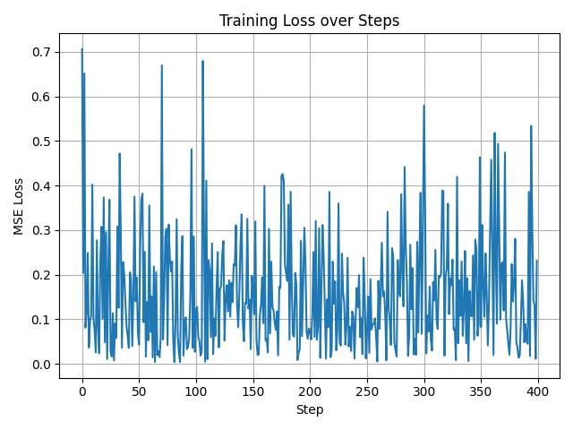
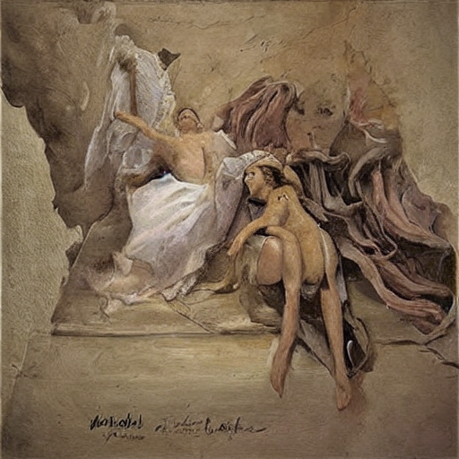
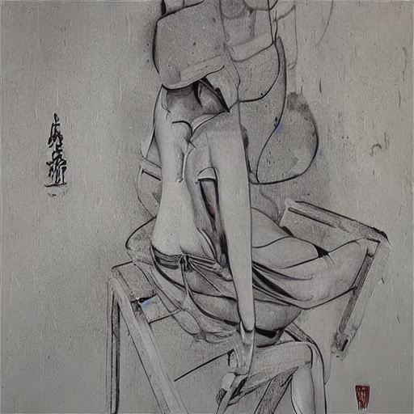
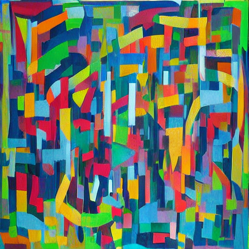

## Roadmap to Research

Research Question: __How do artist demographics and experiences influence artistic production?__

1. __Sociology of Art__ [@bourdieuDistinctionSocialCritique2010; @beckerArtWorlds1982] long pointed our how social background would influence personal artistic productions.

2. __Digital humanity__ [@risamMarginsIntersectionalityDigital2015] started to discuss how intersectionality would relate to artistic production.

3. Increasing number of __large art archive__ [@wikiartWikiArt] as well as development in __computer vision, especially diffusion models__ [@hoDenoisingDiffusionProbabilistic2020] make the systematic and holistic examination become possible.

Yet, [computing bottlenecks]{.alert} exist along with the developments.

## Large-Scale Pipeline: Bottlenecks & Overcomes

Major Bottlenecks: Data Requests & Model Training/Calling Cost

. . .

{width=800px}

## *Step 0: Prior Data Collection

“WikiArt already features some 250.000 artworks by 3.000 artists”

::::: columns
::: {.column width="50%"}

:::

::: {.column width="50%"}

:::
:::::

For the artist and artwork basic datasets, I scraped them by selenium, which could be hard to parallelize. For details, see my other repository [__here__](https://github.com/yangyuwang/wikiart_metadata).

## [Step 1: Data Collection](https://github.com/yangyuwang/Demographic2Art/tree/main/Step1_ec2_scraping)

## [Step 1: Data Collection](https://github.com/yangyuwang/Demographic2Art/tree/main/Step1_ec2_scraping)

1. Image URLs → Images ([`ec2_scraping.ipynb`](https://github.com/yangyuwang/Demographic2Art/blob/main/Step1_ec2_scraping/ec2_scraping.ipynb))

    - use 8 EC2 instances to request different batches of URLs, then save images onto S3 bucket

2. Wikipedia URLs → Contents → Demographics ([`ec2_gpt.ipynb`](https://github.com/yangyuwang/Demographic2Art/blob/main/Step1_ec2_scraping/ec2_gpt.ipynb))

    - use 8 EC2 instances to request different batches of URLs [and call GPT API to extract demographic information of artists]{.alert}, then save json files onto S3 bucket
    
*After all, download S3 bucket to Midway3 project folder
    
## [Step 2: Model Training](https://github.com/yangyuwang/Demographic2Art/tree/main/Step2_diffuser_training)

## Step 2: Model Training (con'd)

__Low-Rank Adaptation (LoRA)__ fine-tuning on __Stable Diffusion V1.5__ by decription-image pairs, through [`train_lora_desc2art.py`](https://github.com/yangyuwang/Demographic2Art/blob/main/Step2_diffuser_training/train_lora_desc2art.py) and [`train_lora_desc2art.sbatch`](https://github.com/yangyuwang/Demographic2Art/blob/main/Step2_diffuser_training/train_lora_desc2art.sbatch).

-  __Grid Search__ upon 6 (2*3) hyperparameter conditions, by [`train_lora_desc2art.sh`](https://github.com/yangyuwang/Demographic2Art/blob/main/Step2_diffuser_training/train_lora_desc2art.sh):

    1. [Learning Rates]{.alert} (1e-5, 1e-4, 1e-3): the `lr` hyperparameter controls the step size of each gradient update.

    2. [Seeds]{.alert} (42, 43): the `seed` hyperparameter simply change the random seed of the training, which proved to be crucial [@picardTorchmanual_seed3407AllYou2023].

- __Other hyperparameter settings__:
rank = 4; max_train_step = 20,000; batch_size = 2; grad_accum = 4.

## Step 2: Model Training (con'd)

Best Model: `learning rate` of 1e-03 and `seed` of 42

::::: columns
::: {.column width="57%"}

:::

::: {.column width="43%"}

:::
:::::

## [Step 3: Webiste Deployment](https://github.com/yangyuwang/Demographic2Art/tree/main/Step3_flask_app)

Website is deployed to call Demographic2Art models on the GPU node, by [`app.py`](https://github.com/yangyuwang/Demographic2Art/blob/main/Step3_flask_app/app.py) and [`app.sbatch`](https://github.com/yangyuwang/Demographic2Art/blob/main/Step3_flask_app/app.sbatch), and it could be `ssh` to the local machine.

## Step 3: Webiste Deployment (con'd)

::: html
<iframe src="http://127.0.0.1:8000/" width="100%" height="550"></iframe>
:::

## Step 3: Webiste Deployment (con'd)

::::: columns
::: {.column width="50%"}

:::

::: {.column width="50%"}

:::
:::::

## *Alternative Pipeline for Personal AWS Account

For a personal AWS account, we can collect data, train model, and deploy website all on cloud, by using the [GPU resources it provides](https://docs.aws.amazon.com/dlami/latest/devguide/gpu.html).

This would include following changes:

1. Step 1 would [not need to download data from S3 to Midway3]{.alert}.

2. Step 2 could just launch different EC2 instances to run grid search, as well as use the [[Weights & Biases API]{.alert}](https://wandb.ai/site/) to record the training process. Please see sweep_* files in the [repository](https://github.com/yangyuwang/Demographic2Art/tree/main/Step2_diffuser_training/samples).

3. Step 3 could deploy a [public website directly]{.alert}, instead of to ssh. 

## Future Works

1. Make the website public or set it as [API]{.alert} for painting generation

2. Comparing between different artist demographic settings

    a. [Quantitatively]{.alert}: use interpretable machine learning techniques to examine the parts affected by certain attributes.
    b. [Qualitatively]{.alert}: manually analyze the painting differences set to different demographic attributes
    
3. Generate [counterfactual paintings]{.alert} to check the social determinants of paintings, for example, _Vincent van Gogh born in the United States_

# Thanks for listening!

__Github Repo see [https://github.com/yangyuwang/Demographic2Art](https://github.com/yangyuwang/Demographic2Art).__

## References
