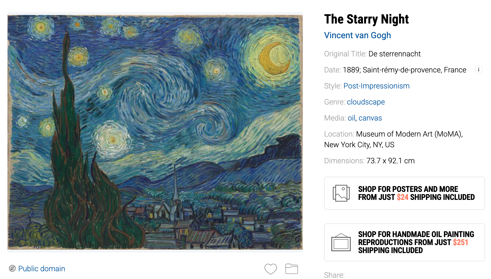
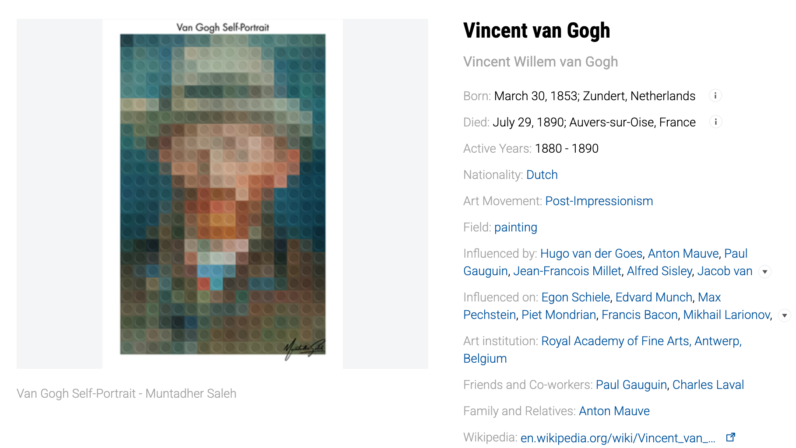
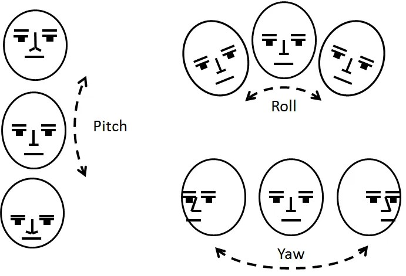
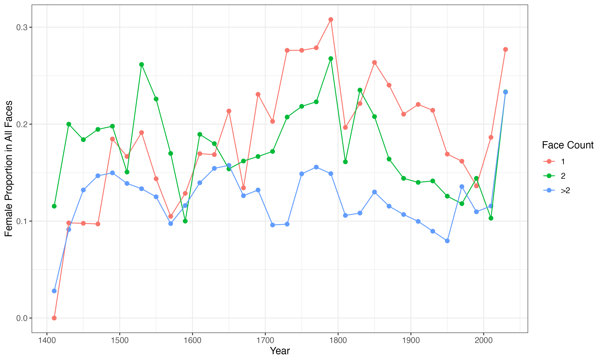
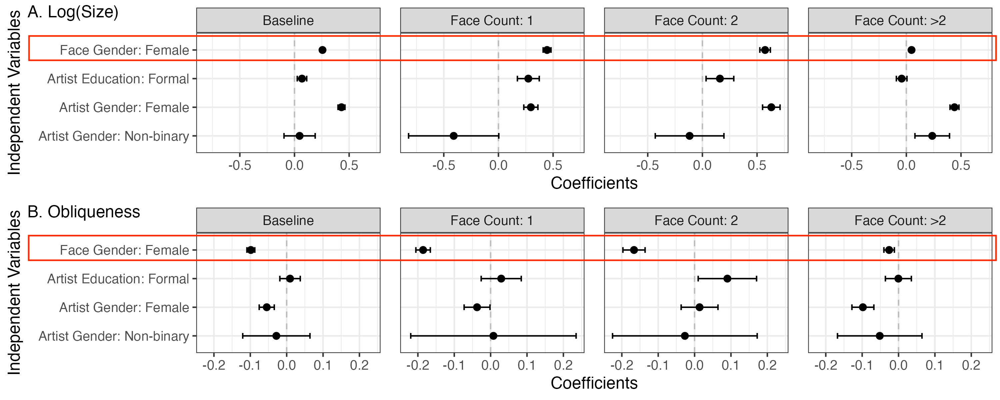
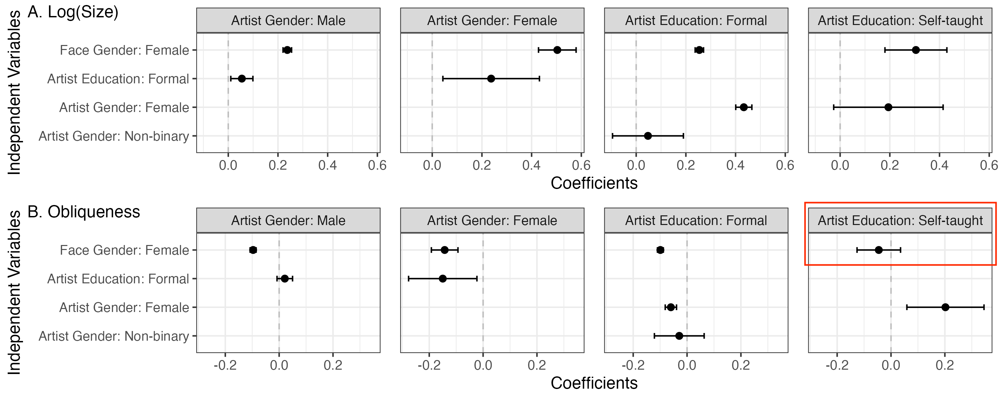
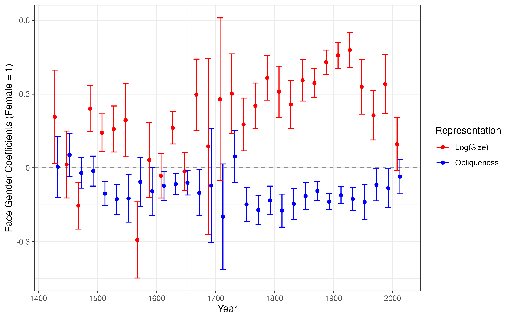
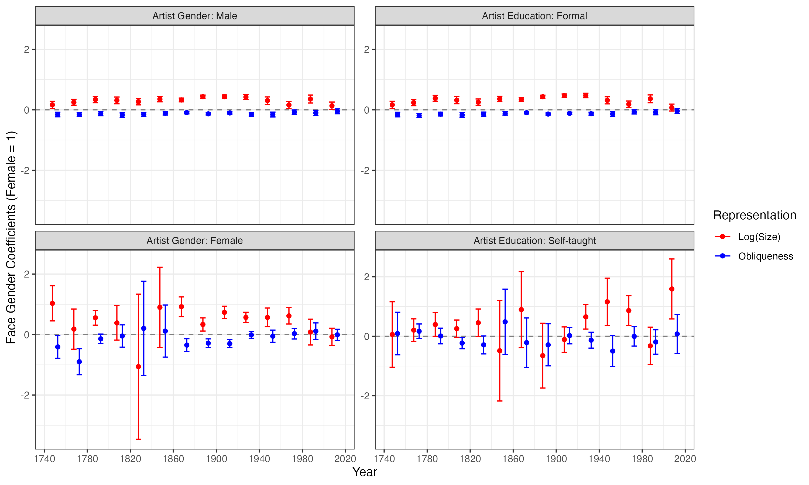
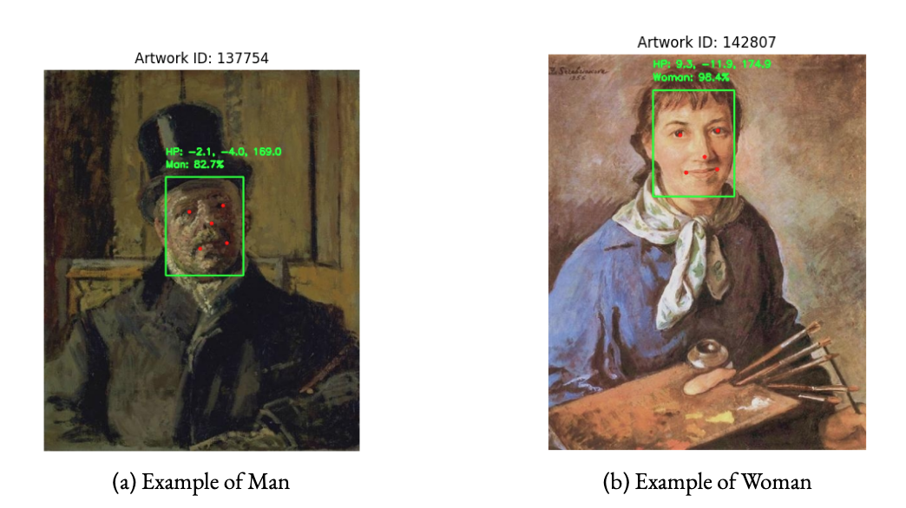
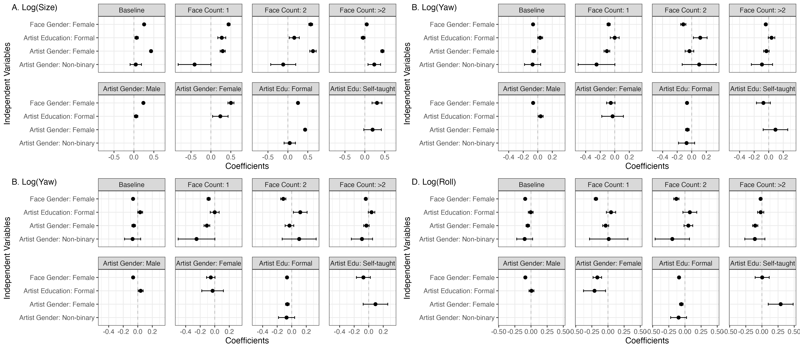

## 

::::: columns
::: {.column width="70%"}
{fig-align="left"}
:::

::: {.column width="10%"}
:::
:::::

## 

::::: columns
::: {.column width="70%"}
{fig-align="left"}
:::

::: {.column width="20%"}
{width="50%"}

{width="50%"}

{width="50%"}
:::
:::::

## Roadmap {.center}

**RQ: How are genders depicted in paintings through the history?**

. . .

1.  Theoretical Background

2.  Data & Methods

3.  Results: Tracing Gender Disparities in Paintings

4.  Discussion & Conclusion

# Theoretical Background

## From Culture to Inequality*

-   [**Sociological theories**]{.alert} long argued the cultural
    inequality

    -   Symbolic interactionsim perspective
        [@goffmanGenderAdvertisements1979]
    -   Structuralism perspective
        [@bourdieuDistinctionSocialCritique1984]
    -   Cultural Boundaries-Inequality
        [@lamontWhatMissingCultural2014]


-   [**Feminist art historical studies**]{.alert} observed gender
    inequality in cultures

    -   *"Male Gaze"* [@mulveyVisualPleasureNarrative1975 for film;
        @nochlinWomenArtPower1989 for art history]
    -   *"Men act and women appear."* [@bergerWaysSeeing1972]


-   [**Computational Analyses**]{.alert} supported the ideas

    -   Texts [@gargWordEmbeddingsQuantify2018;
        @charlesworthHistoricalRepresentationsSocial2022]
    -   Images [@adukiaWhatWeTeach2023;
        @guilbeaultOnlineImagesAmplify2024]

## Gender Inequality in Paintings

Why paintings are crucial for gender inequality?

-   With deliberation [@bergerWaysSeeing1972] and long history
    [@aubertPleistoceneCaveArt2014].

-   Large-scale inequality analyses are mainly upon ["real"/"factual"
    images]{.alert} [@adukiaWhatWeTeach2023;
    @guilbeaultOnlineImagesAmplify2024], with little focus on
    [low-indexical images*]{.alert} [@peirceLogicSemioticTheory1940].


*Indexicality: to what extent one __symbol__ could link to the __object__

. . .

The distance between paintings and reality would be long, increasing the chances of amplifying inequality, through __two pathways__.

## Gender Inequality in Paintings: Two Pathways

. . .

1.  Inequality by [Otherness]{.alert}
    [@goffmanGenderAdvertisements1979]:

    -   Women are more tiny and avoidant, deployed to underscore
        masculine power and strength rather than portrayed as autonomous
        subjects
    -   echoing the notion of "the second sex" [@beauvoirSecondSex2012]

. . .

2.  Inequality by [Objectification]{.alert}
    [@mulveyVisualPleasureNarrative1975]

    -   Female figures are objectified as idealized embodiments of
        beauty, rendered with exaggerated scale and frontal prominence
        to satisfy an implicitly masculine viewer
    -   examined by content analysis in art historical research
        [@bergerWaysSeeing1972; @nochlinWomenArtPower1989]

## Hypotheses: Gender Disparity in Paintings

. . .

**H1**: Female characters appear [less frequently]{.alert} in paintings
than male.

. . .

**H2**: [Sizes]{.alert} of different genders in paintings are different.

```         
 H2.A: Female characters in the paintings are smaller than male characters in sizes.

 H2.B: Female characters in the paintings are larger than male characters in sizes.
```

. . .

**H3**: [Postures]{.alert} of different genders in paintings are
different.

```         
 H3.A: Female characters in the paintings are more oblique than male characters.

 H3.B: Female characters in the paintings are more frontal than male characters.
```

. . .

**H4**: [Marginalized artists]{.alert} will depict female and male
characters in a [more equal manner]{.alert}, compared to the artists
from dominant groups.

# Data & Methods

## WikiArt.org Dataset

A user-generated artwork database

“WikiArt already features some 250.000 artworks by 3.000 artists”

::::: columns
::: {.column width="50%"}

:::

::: {.column width="50%"}

:::
:::::

## Artwork Information: Face Detection

1.  [Face Detection]{.alert}: RetinaFace
    [@dengRetinaFaceSinglestageDense2019] [[Face count trend]{.button}](#Appendix2)

2.  [Gender Detection]{.alert}: DeepFace
    [@taigmanDeepFaceClosingGap2014]
    

3.  [Face Modeling]{.alert}: Constructing 3D models of faces, and comparing current face model to a neutral
    face model [[Example of facial recognition and detection]{.button}](#Appendix1)

    -   To get the *Yaw*, *Pitch*, and *Roll* values of faces

{fig-align=center}

## Artwork Information: Variables

1.  [Size]{.alert}: the ratio of the face area to the canvas area

2.  [Obliqueness]{.alert}: the factor score building upon *yaw*,
    *pitch*, and *roll* from the face modeling process (explaining *31%*
    of the variance). [[Models upon raw values]{.button}](#Appendix3)

. . .


## Artwork Information: Variables

1.  [Size]{.alert}: the ratio of the face area to the canvas area

2.  [Obliqueness]{.alert}: the factor score building upon *yaw*,
    *pitch*, and *roll* from the face modeling process (explaining *31%*
    of the variance). [[Models upon raw values]{.button}](#Appendix3)

. . .


## Artwork Information: Variables


## Artist Information: Variables {.center}

Extracted from [Wikipedia texts of artists by GPT-4o-mini with few-shot
chain-of-thought prompt]{.alert}

1.  [Gender]{.alert}: three categories of *"female"*, *"male"*, and
    *"non-binary"*.

2.  [Education]{.alert}: two categories of *"self-taught"* and
    *"formal"*.

. . .

[Marginalized vs. dominant artists]{.alert}: *Female* vs. *Male*,
*Self-taught* vs. *formal*

## Regressions: Random Intercepts on Face Counts

. . .

1.  Baseline Model: 

    ::: {style="font-size:0.7em; text-align:center;"}
    $$
    \begin{aligned}
    Y_{ij} \sim \beta_0 + \beta_1\, \text{FaceGender}_{ij} + \beta_2\, \text{ArtistInfo}_{j} + \sum_{t=1}^{T}\beta_t\, \text{Period}_{ij}
    \end{aligned}
    $$
    :::
    
    $\therefore$ [Gender disparity]{.alert} $\scriptsize \sim \beta_1$


. . .

2.  Period-interacted Model - Trend Analysis:

    ::: {style="font-size:0.7em; text-align:left;"}
    $$
    Y_{ij} \sim \beta_0' + \beta_1'\, \text{FaceGender}_{ij} + \beta_2'\, \text{ArtistInfo}_{j} + \sum_{t=1}^{T}\beta_t'\, \text{Period}_{ij} \\
     + \sum_{t=1}^{T}\beta_{t1}'\, \text{Period}_{ij} \times \text{FaceGender}_{ij} 
    $$
    :::

    $\therefore$ [Gender disparities for each period]{.alert} $\scriptsize \sim \beta_{1t}' = \beta_1' + \beta_t'$

## Content Analysis upon Paintings*

Follow the idea of purposeful sampling [@palinkasPurposefulSamplingQualitative2015]

. . .

-  Step 1. [Maximum‑variation sampling]{.alert}: Finding the period at the turning point of the trend

-  Step 2. [Paired sampling]{.alert}: Comparing between two paintings of different genders in that period

. . .
 
Considering saturation [@guestHowManyInterviews2006], I focused on [less famous paintings with more gender differences]{.alert}, in case of introducing biases to the analysis.

# Results

## Gender Representations in Paintings

::::: columns
::: {.column width="70%"}



:::
::: {.column width="30%"}

[$\to$ H1]{.alert}

At most, the female proportions in faces are around [30%]{.alert}.

More faces in the painting, less the female proportions in faces. 

:::
:::::

## Gender Representations in Paintings

::::: columns
::: {.column width="90%"}

:::
:::::

[$\to$ H2.B & H3.B]{.alert}: Female faces are persistently [larger]{.alert} and [frontal]{.alert} than male faces.

## Gender Representations in Paintings

::::: columns
::: {.column width="90%"}

:::
:::::

[$\to$ H4]{.alert}: Marginalized artists hardly bridge the gender gap, while [self-taught]{.alert} artists do depict females more equally in obliqueness.

## Tracing Gender Disparities in Paintings, 1400–2024

::::: columns
::: {.column width="70%"}

:::
::: {.column width="30%"}
[$\to$ H2.B & H3.B]{.alert}

Overall, the gender disparities are persistent across time.

[Period differences]{.alert}: mainly in early and late periods

:::
:::::

## Tracing Gender Disparities in Paintings, 1400–2024

::::: columns
::: {.column width="75%"}

:::
::: {.column width="25%"}
[$\to$ H4]{.alert}

The marginalized artists [bridged the gap between gendered figures earlier]{.alert} than dominant ones.

:::
:::::
## Tracing Gender Disparities in Paintings, 1400–2024*


# Discussion & Conclusion

“Representation of the world, like the world itself, is the work of men; they describe it from their own point of view, which they confuse with absolute truth.”

::: {style="text-align: right"}
\- _The Second Sex_ (1949), by Simone de Beauvoir
:::

## Summary of Results {.center}

|Results|Hypothesis|Theory|
|-|:-:|:-:|
|Female faces are __fewer__ than male ones.|H1|/|
|Female faces are __larger__ than male ones.|H2.B|Objectification|
|Female faces are __more frontal__ than male ones.|H3.B|Objectification|
|Marginalized artists are __similar__ to dominant ones.|H4|Gate-keeping|
|Marginalized artists __bridged the gap earlier__.|H4|Embodiment|


## Implications

- [Symbolic Annihilation and Cultural Reproduction]{.alert}:

    - Females are culturally annihilated in visual materials [@tuchmanSymbolicAnnihilationWomen2000; @okellyGenderRoleStereotypes1983; @adukiaWhatWeTeach2023; @weitzmanSexRoleSocializationPicture1972].
    - Paintings reproducing gender inequality [@butlerGenderTroubleFeminism1990], even by marginalized artists [@placakovaWhoWon19892024].
    
. . .

- [Inequality by Objectification]{.alert}:

    -  Paintings follow "objectification" [@bergerWaysSeeing1972; @nochlinWomenArtPower1989].
    -  Mirroring the contradictory phenomenon that the number of female artists and female characters are unproportional [@guerrillagirlsWomenHaveBe1989; @mcshineInternationalSurveyRecent1985]

## Implications

-  [Scaling Visual Analysis]{.alert}:

    -  How computational measurement (for example 3D modeling of faces) could be utilized to large-scale visual materials.
    - extending the analysis towards [fine art]{.alert} from other visual materials [@adukiaWhatWeTeach2023; @guilbeaultOnlineImagesAmplify2024; @mazieresComputationalAppraisalGender2021]

## Limitations

1. [Data biases]{.alert}:

    - WikiArt dataset may be biased towards certain periods.

2. [Face detection]{.alert}:

    - Face detection algorithm could lean to contemporary photographic dataset.

3. [Wikipedia extraction]{.alert}:

    - LLM extraction is efficient, but may introduce errors.


# Q&A

Thanks for listening!

<div style="text-align:center">
  GitHub Repo
  
  
</div>

## References

::: {#refs}
:::

## Appendix 1. Face Detection Examples {#Appendix1}



## Appendix 2. Face Count Trend {#Appendix2}


## Appendix 3. Models upon _Size, Yaw, Pitch, Roll_ {#Appendix3}

