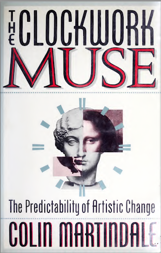
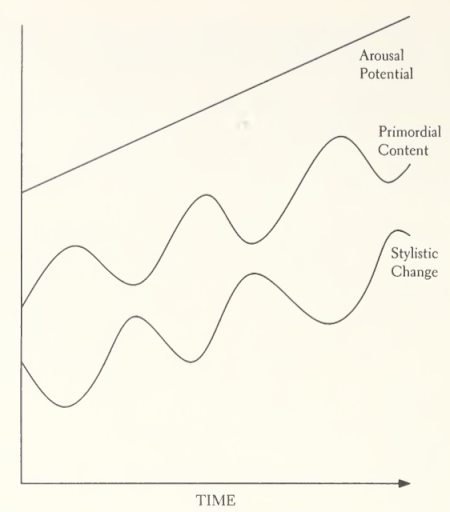
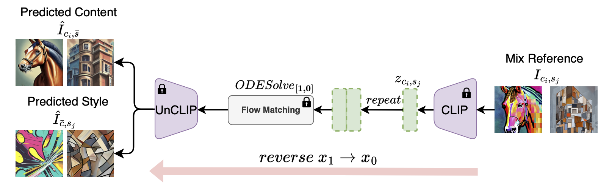
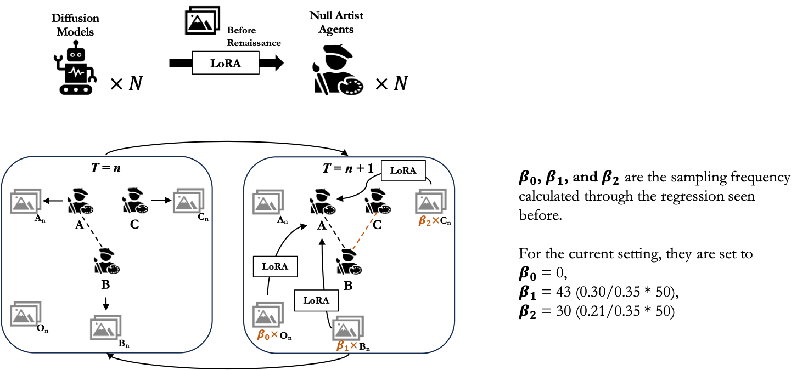
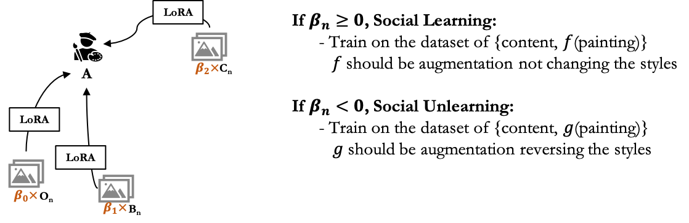
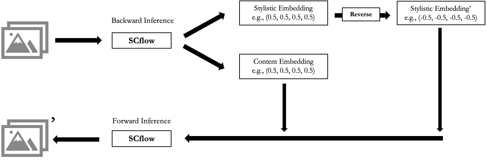
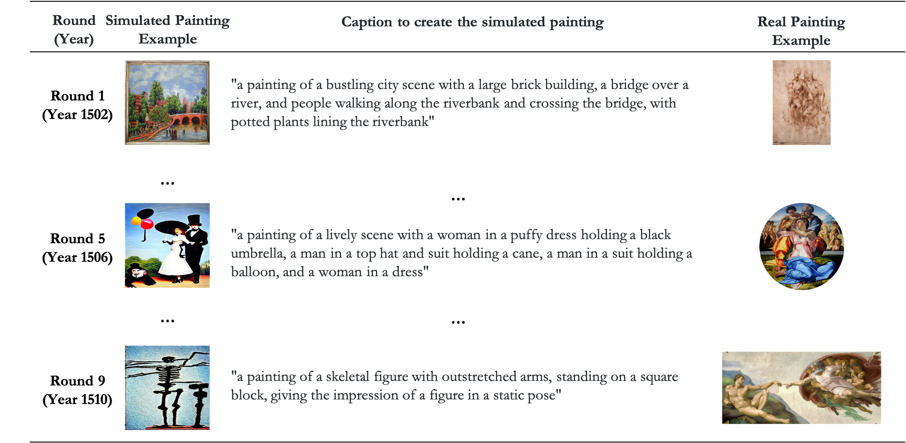

## {data-background-image="meeting/titlepage.png" data-background-size="contain" data-background-opacity="1"}

## Roadmap

1.  What is Creativity, How to Measure it, and Why can(not) Machines Replicate it?
2.  A Multi-agent Framework for Machine Creativity
    a.  Social interactionism and Sociology-of-art insights
    b.  Diffusion models as agents
3.  Simulating the Stylistic Evolution of Painting from 1500 to 1510
4.  Next-Step Plans

## What is creativity?

:::: {.columns}

::: {.column width="45%"}
 
:::

::: {.column width="50%"}
 
:::

::::

## What is creativity? {visibility="uncounted"}

Human create artworks through a **law of novelty** (Martindale, 1990):

:::: {.columns}

::: {.column width="25%"}

 

:::

::: {.column width="50%"}

 

1.  Arousal Potential
2.  Habituation

-> *Fluctuations in content and style*
    
:::

::::

One way to understand creativity is through **the stylistic shifts**.

## How to measure stylistic shifts?

**SCFlow (Ma et al. 2025):** Inference from images to their contents and styles

## How to measure stylistic shifts?

Based on WikiArt-collected paintings from 1400 to 2024, we create a stylistic embedding space.

<iframe src="http://127.0.0.1:8050/" width="100%" height="600px"></iframe>

## Why machines can(not) replicate human creativity?

Reliance on training data -> **Bias, Uniformity, Atemporality, Disembodiment** (Kozlowski & Evans, 2025)

**Model Autophagy Disorder** (Alemohammad et al., 2024)

## Why machines can(not) replicate human creativity?

Reliance on training data -> **Bias, Uniformity, Atemporality, Disembodiment** (Kozlowski & Evans, 2025)

**Model Autophagy Disorder** (Alemohammad et al., 2024)

[Yet,]{.alert}

Some digital artists have long tried to use **the randomness in models** (such as GANs) to create novel artworks.

Tech companies such as Adobe are developing AI tools to facilitate creation.

## Why machines can(not) replicate human creativity? {visibility="uncounted"}

 

<iframe src="https://www.nora-al-badri.de/works-index" width="100%" height="500px"></iframe>

## A Multi-agent Framework for Machine Creativity

### Social interactionism and Sociology-of-art traditions

Social interactions create shared meanings which aggregate to cultural symbols (Blumer, 1969; Goffman, 1959; Mead, 1934).

Later works on art world (Becker, 1982) emphasize the idea on artistic productions as collective invention.

-> Can we build a [interaction-based multi-agent framework]{.alert} to facilitate machine creativity?

## A Multi-agent Framework for Machine Creativity

### Social interactionism and Sociology-of-art traditions

Based on WikiArt-collected paintings, we build a dataset of pairs of paintings, assigned the social interaction attributes between the artists who made them.

## A Multi-agent Framework for Machine Creativity

### Social interactionism and Sociology-of-art traditions

Based on WikiArt-collected paintings, we build a dataset of pairs of paintings, assigned the social interaction attributes between the artists who made them.

## A Multi-agent Framework for Machine Creativity

### Diffusion models as agents

Latent Diffusion Model Architecture (Rombach et al., 2022)

## A Multi-agent Framework for Machine Creativity

### Diffusion models as agents

Low-Rank Adaptation (LoRA, Hu et al., 2021)

:::: {.columns}

::: {.column width="40%"}

:::

::: {.column width="60%"}

$$h = W_0 x + \Delta W_x = W_0 x + BAx$$

Later used in diffusion models.

Targeting on the attention layers in UNet.

:::

::::

## A Multi-agent Framework for Machine Creativity

### Diffusion models as agents

"Generate - Perceive - Update" Agentic Society

## *A Multi-agent Framework for Machine Creativity

### Diffusion models as agents

By "Update": we mean [social learning]{.alert} & [social unlearning]{.alert}

## *A Multi-agent Framework for Machine Creativity

### Diffusion models as agents

By "Update": we mean [social learning]{.alert} & [social unlearning]{.alert}

## *A Multi-agent Framework for Machine Creativity

### Diffusion models as agents

A type of "unlearning" $g$ augmentation

## Simulating the Stylistic Evolution of Painting from 1500 to 1510

This is a pilot test on 17 key artists around high Renaissance period, within 10 rounds of training. *Example: Michelangelo *

## Simulating the Stylistic Evolution of Painting from 1500 to 1510

We use SCflow to vectorize the simulated paintings back to the stylistic embedding space.

<iframe src="http://127.0.0.1:8051/" width="100%" height="500px"></iframe>

## Simulating the Stylistic Evolution of Painting from 1500 to 1510

To validate whether the agentic framework is valid or not, we develop [an evolution-based creativity (semi-)benchmark]{.alert}.

1. Training validation: within-vs-between comparison

2. Artist-level validation:

    a. centroid differences in style between real and simulated artists
    
    b. shift differences in style between real and simulated artists
    
3. Period-level validation:

    a. centroid differences in style between real and simulated periods
    
    b. shift differences in style between real and simulated periods

## Simulating the Stylistic Evolution of Painting from 1500 to 1510
### 1. Training validation

We test whether each training process is valid, by comparing the similarities [within]{.alert} one agent's own creations to the ones [between]{.alert} one and others.

## Simulating the Stylistic Evolution of Painting from 1500 to 1510
### 2. Artist-level validation

We test whether the agents by their centroids show (a) [similar styles]{.alert} (b) [similar shifts]{.alert} in styles across rounds to the real history.

## {data-background-image="meeting\results\fig_artist_centroid_trend.png" data-background-size="contain" data-background-opacity="1"}

## Simulating the Stylistic Evolution of Painting from 1500 to 1510
### 3. Period-level validation

a. We test whether the [overall styles]{.alert} among all artists in each round are similar to the style in the real history.

## Simulating the Stylistic Evolution of Painting from 1500 to 1510
### 3. Period-level validation

b. We test whether the [overall style shifts]{.alert} of all artists across rounds are similar to the shifts in the real history.

## Next-Step Plans

1. [Implement social unlearning processes]{.alert} to decrease the chance of collapsing

2. Change to [models with little painting knowledge]{.alert}

3. Complexify the framework by adding normative influence through [geographical movement or educational influence]{.alert}

4. Beyond validation, modify the framework to do [counterfactual analyses]{.alert} or [create novelty outside human creativity]{.alert}

**Always interested in new opportunities to collaborate!**

# Thanks for suggestions!
Yangyu Wang @ KLab

01/19/2026